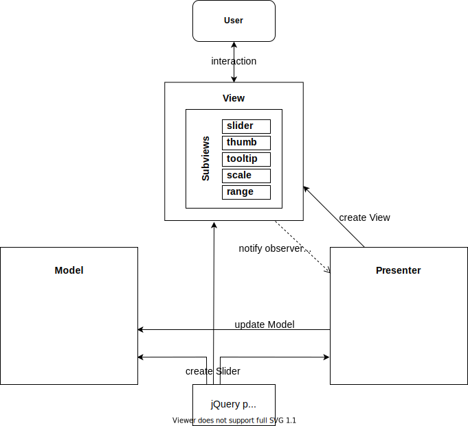
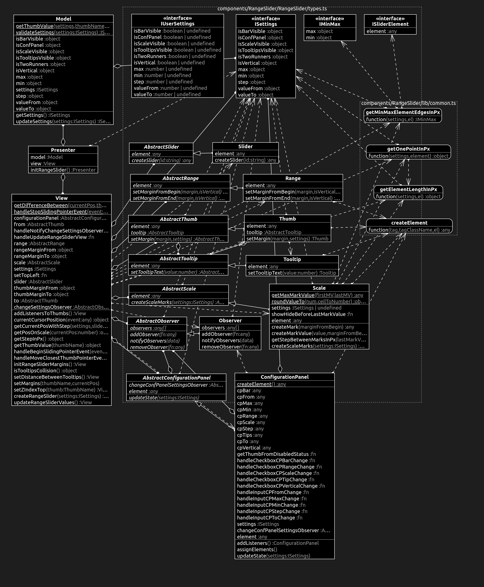

# RangeSlider jQuery Plugin
Table of Contents:
1. [Build Setup](#build-setup)
2. [Plugin Configuration](#plugin-configuration)
3. [Slider Events](#slider-events)
4. [Architecture](#architecture)
5. [UML Classes Diagram](#uml-classes-diagram)

## Build Setup
Plugin created with:

* node v14.18.2
* jQuery 3.6.0

```
# Download repository:
$ git clone https://github.com/WhiteDevilMan/RangeSlider

# Go to the folder:
$ cd RangeSlider

# Install dependencies from package.json:
$ npm install (or 'npm i')

# Start server with hot reload
$ npm run dev

# Build project. Output will be at 'dist' folder
$ npm run build

# Deploy project to gh-pages (after "npm run build")
$ npm run deploy

# Run test
$ npm run test (or 'npm test')

# Lint Styles
$ npm run stylelint-fix
```

## Plugin Configuration

You need to add `<div>` block with `id` on your page.

Example:
```html
<div id='range-slider'></div>
```

And then add to *.js file RangeSlider jQuery plugin with settings.

Example:

```javascript
$('#range-slider').RangeSlider({
  min: 0,
  max: 100,
  valueFrom: 20,
  valueTo: 80,
  step: 1,
  isTwoRunners: true,
  isScaleVisible: true,
  isTooltipsVisible: true,
  isVertical: false,
  isConfPanel: false,
  isBarVisible: true,
});
```

## Slider Events

To subscribe to slider event you need to:
* Add Observer property to class properties and initialize it in the constructor

Example:
```javascript
export default class View {
  changeSettingsObserver: AbstractObserver;

  constructor() {
    this.changeSettingsObserver = new Observer();
  }
```
* In the code where you want to subscribe on this observer add
```
yourObserver.addObserver(data? => { /* your code */ })
```

Example:
```javascript
this.view.changeSettingsObserver.addObserver((settings: ISettings) => {
  // Your code. Example:
  this.model.updateSettings(settings);
});
```

To unsubscribe from slider event you need to remove observer:
```javascript
this.view.changeSettingsObserver.removeObserver((settings: ISettings) => {
  this.model.updateSettings(settings);
});
```

## Architecture

RangeSlider uses **MVP** (Model View Presenter) architecture.

**Model** - works with data, performs validations, calculations and manages business processes.

**View** - shows the user the interface and data from the *model*.

**Presenter** - serves as a layer between the *model* and the *view*.



Layers are unlinked from external dependencies using abstract classes. Data between layers is transmitted using the observer pattern.

## UML Classes Diagram


