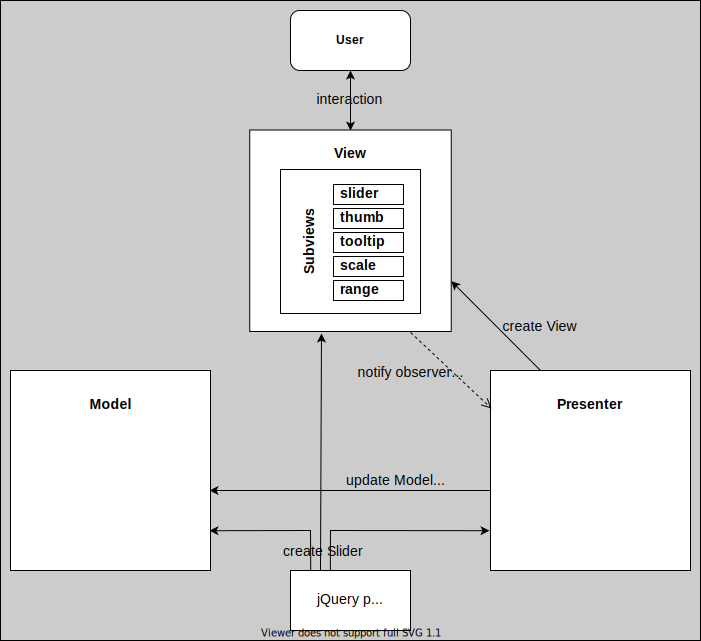

# RangeSlider jQuery Plugin

<a href="https://whitedevilman.github.io/RangeSlider/">Demo Page</a>

Table of Contents:

1. [Build Setup](#build-setup)
2. [Plugin Configuration](#plugin-configuration)
3. [Slider Events](#slider-events)
4. [Architecture](#architecture)
5. [UML Classes Diagram](#uml-classes-diagram)

## Build Setup

Plugin created with:

- Node.js v14.18.3
- jQuery 3.6.0

```
# Download repository:
$ git clone https://github.com/WhiteDevilMan/RangeSlider

# Go to the folder:
$ cd RangeSlider

# Install dependencies from package.json:
$ npm install (or 'npm i')

# Start server with hot reload
$ npm run dev

# Build project. Output will be at 'dist' folder
$ npm run build

# Build project with demo page. Output will be at 'dist' folder
$ npm run build-demo

# Deploy project to gh-pages (after "npm run build")
$ npm run deploy

# Run test
$ npm run test (or 'npm test')

# Lint Styles
$ npm run stylelint-fix
```

## Plugin Configuration

First add jQuery CDN to your page, scripts and styles.

Example:

```html
<script src="https://ajax.googleapis.com/ajax/libs/jquery/3.6.0/jquery.min.js"></script>
<script defer src="range-slider-vendors.js"></script>
<script defer src="range-slider.js"></script>
<link href="range-slider.css" rel="stylesheet" />
```

Then you need to add `<div>` block with `id` on your page.

Example:

```html
<div id="range-slider"></div>
```

And after it add RangeSlider plugin with settings to your.js file.

Example:

```javascript
$('#range-slider').RangeSlider('init', {
  min: 0,
  max: 100,
  from: 20,
  to: 80,
  step: 1,
  range: true,
  scale: true,
  tooltips: true,
  vertical: false,
  confpanel: false,
  bar: true,
});
```

Also, you could use plugin from console in your browser with the same command

```javascript
$('#range-slider').RangeSlider('init', {
  min: 0,
  max: 100,
  from: 20,
  to: 80,
  step: 1,
  range: true,
  scale: true,
  tooltips: true,
  vertical: false,
  confpanel: false,
  bar: true,
});
```

You may pass to slider settings that you need to update its settings

```javascript
$('#range-slider').RangeSlider('update', {
  min: 20,
  max: 80,
  confpanel: true,
});
```

## Slider Events

To subscribe to slider event you need to:

- Add Observer property to class properties and initialize it in the constructor

Example:

```javascript
export default class View {
  changeSettingsObserver: AbstractObserver;

  constructor() {
    this.changeSettingsObserver = new Observer();
  }
```

- In the code where you want to subscribe on this observer add

```
yourObserver.addObserver(data? => { /* your code */ })
```

Example:

```javascript
this.view.changeSettingsObserver.addObserver((settings) => {
  // Your code. Example:
  this.updateModelAndPanel(<IModelSettings>settings);
});
```

To unsubscribe from slider event you need to remove observer:

```javascript
this.view.changeSettingsObserver.removeObserver((settings) => {
  // Your code. Example:
  this.updateModelAndPanel(<IModelSettings>settings);
});
```

## Architecture

RangeSlider uses **MVP** (Model View Presenter) architecture.

**Model** - works with data, performs validations, calculations and manages business processes.

**View** - shows the user the interface and data from the _model_.

**Presenter** - serves as a layer between the _model_ and the _view_.



Layers are unlinked from external dependencies using abstract classes. Data between layers is transmitted using the observer pattern.

## UML Classes Diagram


